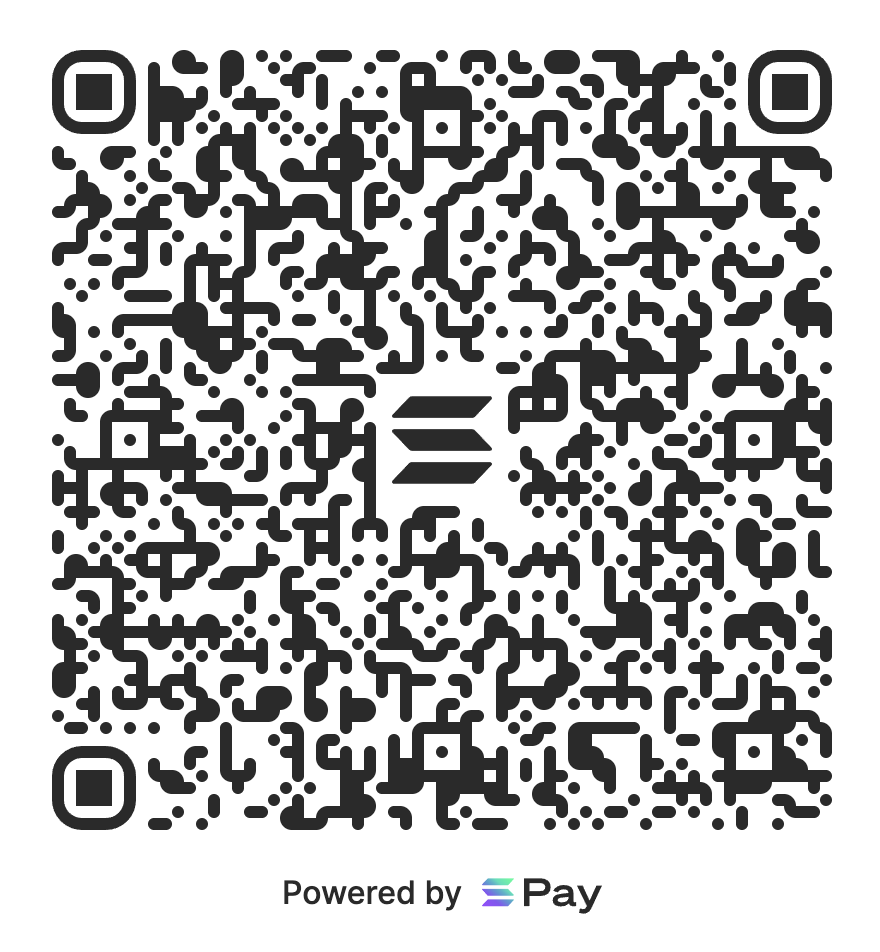

# Solana Pay

Solana Pay is a standard protocol and set of reference implementations that enable developers to incorporate decentralized payments into their apps and services.

[Read the specification.](SPEC.md)

The Solana blockchain confirms transactions in less than a second and costs on average $0.0005, providing users a seamless experience with no intermediaries.

[Read the docs to get started.](https://docs.solanapay.com)

## Supporting Wallets

- **Phantom** ([iOS](https://apps.apple.com/us/app/phantom-solana-wallet/id1598432977), [Android](https://play.google.com/store/apps/details?id=app.phantom&hl=en_US&gl=US))
- **Solflare** ([iOS](https://apps.apple.com/us/app/solflare/id1580902717), [Android](https://play.google.com/store/apps/details?id=com.solflare.mobile))
- **Glow** ([iOS](https://apps.apple.com/app/id1599584512), [Android](https://play.google.com/store/apps/details?id=com.luma.wallet.prod))
- **Decaf Wallet** ([iOS](https://apps.apple.com/nz/app/decaf-wallet/id1616564038), [Android](https://play.google.com/store/apps/details?id=so.decaf.wallet))
- **Espresso Cash** ([iOS](https://apps.apple.com/us/app/crypto-please/id1559625715), [Android](https://play.google.com/store/apps/details?id=com.pleasecrypto.flutter))
- **Tiplink** ([Web](https://tiplink.io))
- **Bitget Wallet** ([iOS](https://apps.apple.com/app/id1395301115), [Android](https://play.google.com/store/apps/details?id=com.bitkeep.wallet))

## Installation

```bash
npm install @solana/pay @solana/kit
```

`@solana/pay` is built on [`@solana/kit`](https://github.com/anza-xyz/kit) and requires the following peer dependencies:

```bash
npm install @solana-program/system @solana-program/token @solana-program/token-2022 @solana-program/memo
```

## Quick Start

```ts
import { encodeURL, createQR } from '@solana/pay';
import { address } from '@solana/kit';

// Create a payment URL
const url = encodeURL({
    recipient: address('YOUR_WALLET_ADDRESS'),
    amount: 1.0,
    label: 'My Store',
    message: 'Thanks for your purchase!',
});

// Generate a QR code
const qr = createQR(url);
```

## Development

Prerequisites: [Node.js](https://nodejs.org) v20+, [pnpm](https://pnpm.io), [just](https://github.com/casey/just)

```bash
just install    # install dependencies
just build      # build the core package
just test       # run tests
just            # show all commands
```

## License

Solana Pay is open source and available under the Apache License, Version 2.0. See the [LICENSE](./LICENSE) file for more info.


